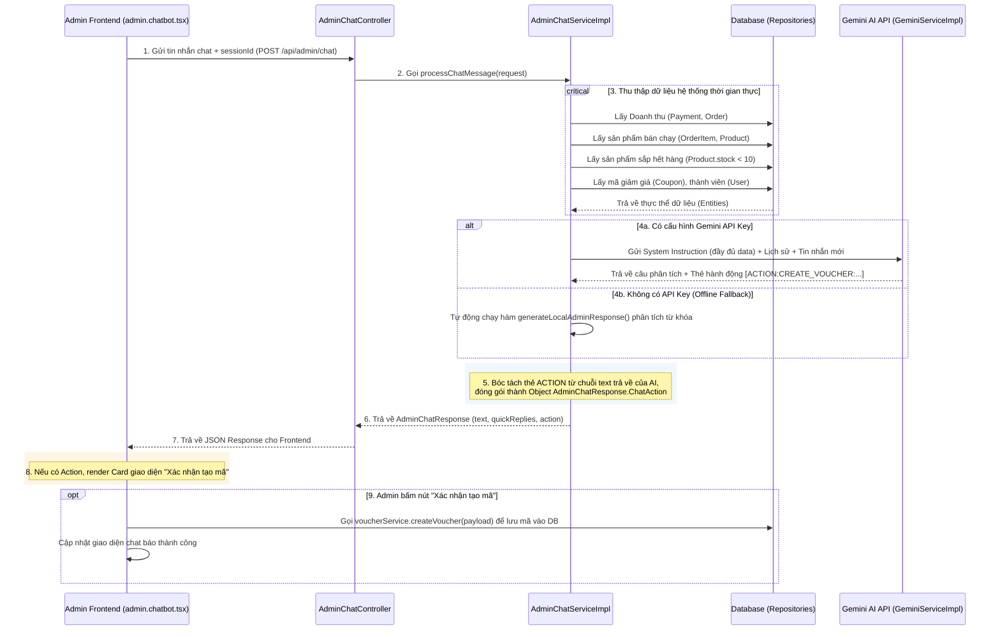

# BẢN PHÂN TÍCH LUỒNG KỸ THUẬT & NGHIỆP VỤ ADMIN AI ASSISTANT (VOLTBOT ADMIN)

Dưới đây là chi tiết luồng hoạt động từ Client (Giao diện Admin) đến Server (Backend), đi qua các Class, Controller, Service và Database cụ thể để phục vụ việc giải thích/bảo vệ đồ án tốt nghiệp.

---

## 1. SƠ ĐỒ LUỒNG DỮ LIỆU TỔNG QUAN (DATA FLOW)

---

## 2. CHI TIẾT CÁC BƯỚC XỬ LÝ TRONG MÃ NGUỒN (CODE WALKTHROUGH)

### BƯỚC 1: Tiếp nhận Request tại Controller
- **Class**: `com.techshop.backend.controller.AdminChatController`
- **Phương thức**: `sendMessage(@RequestBody AdminChatRequest request)`
- **Xử lý**: 
  - Tiếp nhận DTO `AdminChatRequest` (chứa `sessionId` và `message` của quản trị viên).
  - Gọi phương thức nghiệp vụ: `adminChatService.processChatMessage(request)`.

---

### BƯỚC 2: Khởi tạo/Phục hồi Hội thoại (Session Context)
- **Class**: `com.techshop.backend.service.Impl.AdminChatServiceImpl`
- **Phương thức**: `processChatMessage`
- **Xử lý**:
  - Gọi `chatSessionMemory.getOrCreateSession(sessionId)` để phục hồi lịch sử trò chuyện nhằm duy trì ngữ cảnh trao đổi tiếp diễn của quản trị viên.

---

### BƯỚC 3: Tổng hợp số liệu thời gian thực từ Database
Để AI có số liệu chính xác để phân tích, hệ thống thực hiện truy vấn trực tiếp từ cơ sở dữ liệu:
- **Thống kê Doanh thu (Hôm nay, Hôm qua, 7 ngày qua, 30 ngày qua)**:
  - Tính tổng các giao dịch thành công qua cổng thanh toán (`paymentRepository.findAll()`).
  - Cộng thêm các đơn hàng giao dịch COD đã được xác nhận thanh toán (`orderRepository.findAll()`).
  - Phân nhóm thời gian theo các mốc `startOfToday`, `startOfYesterday`, `startOfThisWeek`, `startOfThisMonth`.
- **Top sản phẩm bán chạy**:
  - Quét danh sách đơn hàng, đếm số lượng bán (`quantity`) của từng sản phẩm thông qua bảng `OrderItem`.
  - Sắp xếp và lấy ra **Top 5 sản phẩm bán chạy nhất**.
- **Sản phẩm sắp hết hàng**:
  - Lọc ra các sản phẩm có số lượng tồn kho `stock < 10` để cảnh báo Admin nhập thêm hàng.
- **Voucher và Khách hàng**:
  - Thống kê các mã giảm giá đang chạy (`activeVouchers`) và số lượng thành viên đã đăng ký (`allUsers.size()`).

---

### BƯỚC 4: Giao tiếp với AI (Hoặc Dự phòng Ngoại tuyến)

#### Trường hợp A: Sử dụng Gemini AI
- **Xây dựng chỉ dẫn hệ thống (System Instruction)**:
  - Hàm `processChatMessage` gộp toàn bộ số liệu doanh thu, sản phẩm bán chạy, sản phẩm sắp hết hàng vào một Prompt cực kỳ chi tiết.
  - Cung cấp cú pháp chuẩn để AI đề xuất hành động:
    `[ACTION:CREATE_VOUCHER:code=MÃ_GIẢM_GIÁ,type=percentage|fixed,value=SỐ_TIỀN_HOẶC_PHẦN_TRĂM,minSpend=ĐƠN_TỐI_THIỂU]`
  - Gọi `geminiService.generateContent(sys.toString(), message, session.getHistory())` để nhận câu trả lời dạng Markdown từ AI.

#### Trường hợp B: Sử dụng Local Fallback (Dự phòng offline)
- Nếu khóa API Key trống, hệ thống gọi hàm `generateLocalAdminResponse(...)`:
  - Sử dụng so khớp từ khóa (keyword contains) để phát hiện nhu cầu của admin:
    - Từ khóa `doanh thu`, `doanh số` $\to$ Trả về bảng số liệu doanh thu.
    - Từ khóa `tồn kho`, `hết hàng` $\to$ Trả về danh sách sản phẩm có số lượng dưới 10.
    - Từ khóa `bán chạy`, `hot` $\to$ Trả về top 5 sản phẩm bán chạy.
    - Từ khóa `tạo mã`, `tạo voucher` $\to$ Tự động phân tích tên mã (regex chữ in hoa) và phần trăm giảm để sinh thẻ hành động mẫu.

---

### BƯỚC 5: Phân tích thẻ hành động (Action Parsing)
Sau khi có phản hồi dạng text của bot (dù từ Gemini hay Local Parser):
- Kiểm tra xem text có chứa cụm từ `[ACTION:CREATE_VOUCHER:` hay không.
- Nếu có:
  1. Trích xuất các tham số đi kèm như `code`, `type`, `value`, `minSpend`.
  2. Khởi tạo đối tượng `AdminChatResponse.ChatAction` chứa thông tin này.
  3. Cắt bỏ thẻ `[ACTION:...]` khỏi văn bản hiển thị (`botReplyText`) để tránh hiển thị đoạn text thô lộn xộn lên giao diện chat của người dùng.
- Cập nhật lịch sử hội thoại bằng cách lưu tin nhắn mới của user và bot vào `SessionContext`.
- Trả về đối tượng `AdminChatResponse` gồm: văn bản trả lời (`text`), gợi ý phản hồi nhanh (`quickReplies`), và sự kiện hành động (`action`).

---

### BƯỚC 6: Xử lý tại Frontend (Giao diện Admin)

- **Định dạng tin nhắn**: Giao diện chat ([admin.chatbot.tsx](file:///d:/DATN/store-vision-spark/src/routes/admin.chatbot.tsx)) sẽ kết xuất câu trả lời của AI. Đoạn text được hiển thị dưới dạng các thẻ danh sách thụt lề (`<li>`) và định dạng in đậm chữ (`<strong>`) tự nhiên.
- **Nhận diện và hiển thị Action Card**:
  - Nếu trường `action` trong phản hồi khác `null` và có kiểu `CREATE_VOUCHER`, Frontend sẽ hiển thị một **Interactive Action Card** ngay bên dưới bong bóng chat.
  - Card này ghi rõ các tham số gợi ý của AI.
- **Kích hoạt Hành động 1-Click**:
  - Khi Admin nhấn nút **"Xác nhận tạo mã"**:
    1. Frontend gửi yêu cầu tạo mã tới Backend thông qua `voucherService.createVoucher(payload)`.
    2. Chuyển trạng thái giao diện của card từ `pending` sang `success`.
    3. Tự động chèn thêm một tin nhắn thông báo thành công từ bot: *"Hệ thống đã kích hoạt mã giảm giá ... thành công!"*.
  - Nếu Admin nhấn nút **"Bỏ qua"**:
    1. Chuyển trạng thái card sang `cancelled` để ẩn các nút xác nhận.
